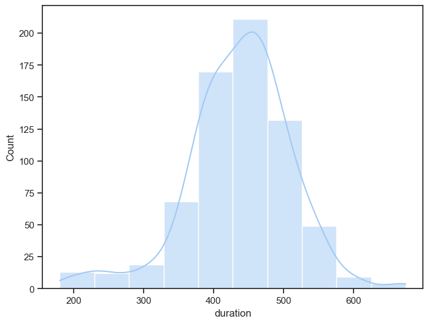
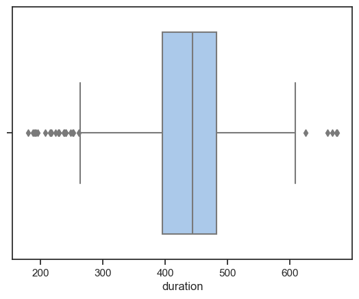
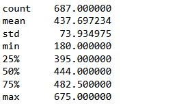

# Tracking the Transition: An Analysis of Fitbit Data Across Borders

<p align="justify">For nearly four years, I've relied on my Fitbit to track virtually every aspect of my daily routine, from the number of steps I take to the quality of my sleep. Even when I go for a stroll or hit the gym, I make sure to wear my trusty device, eager to see how my fitness metrics stack up against my previous workouts. It's a thrilling feeling to watch my physique improve over time, and I'm always eager to see how I can further refine my health habits using the rich data that Fitbit provides.<br><br>Since moving to Canada last year, my daily routine has undergone a significant transformation (new country, new life?), and I've noticed that this shift has impacted various aspects of my life. Specifically, I've observed that my physical activity level and quality of sleep have been affected, but to what extent remains unclear. Fortunately, I've consistently relied on my Fitbit to track my daily activity and sleep patterns, enabling me to investigate these changes in greater detail. With this project, my main objectives are to:</p>

- Analyze how my level of physical activity and exercise has changed since moving to Canada
- Evaluate how my sleep has been impacted during this time
- Explore the Fitbit data for any interesting insights regarding my overall health and wellness.

### Collecting the Fitbit data

<p align="justify">Extracting data from a Fitbit device may seem daunting, but fortunately, Fitbit provides a <a href = "https://dev.fitbit.com/build/reference/web-api/developer-guide/">developer guide</a> to help users establish a connection to their account and access the data they need. This guide is an invaluable resource, containing a comprehensive list of available resources and endpoints, along with details on the syntax required, expected responses, and descriptions of each element returned by every endpoint.<br><br>it's essential to read the <a href="https://dev.fitbit.com/build/reference/web-api/developer-guide/best-practices/">Best Practices</a> section of the developer guide. This section provides guidance on how to optimize your application's performance. It covers crucial topics such as caching, pagination, error handling, and rate limiting, all of which are essential considerations when working with an API.<br><br>During my analysis, I needed data from the past year and quickly discovered the <a href="https://dev.fitbit.com/build/reference/web-api/developer-guide/application-design/#Rate-Limits">rate limits</a> that apply to the Fitbit Web API. Although these rate limits presented a minor inconvenience while extracting the information, they were ultimately a necessary measure to ensure the API's stability and reliability. To work around this limitation, I had to think creatively about how to store my data efficiently.

Once you've established a connection you'll gain access to a wealth of data and resources.</p>


### Preserving the data

<p align="justify">Due to the significant amount of data needed and the rate limits imposed by the Fitbit Web API, storing the data in CSV files was not a viable option. Instead, I opted to create a local PostgreSQL database to securely store the data.<br><br>To get started, I downloaded and installed the latest version of <a href="https://www.postgresql.org/download/">PostgreSQL</a> and set up the database. I then created a table for each API endpoint, specifying the necessary columns and data types for each one. By organizing the data in this way, I could easily access and analyze the information using SQL queries. The database backup can be found <a href="https://github.com/LeoPradilla/FitSleep/blob/main/files/fitbit_api_db">here</a>.</p>

### Collecting and processing the data

<p align="justify">The API provides a range of endpoints for retrieving data on activities, sleep, heart rate, steps, and more. These endpoints respond with a JSON object containing the requested data. The exact format and structure of the response will depend on the endpoint and the specified parameters. The JSON response needs to be parsed and processed to extract the data you need.

For example, to request information about sleep, the endpoint <a href="https://dev.fitbit.com/build/reference/web-api/sleep/get-sleep-log-list/">Get Sleep Log List</a> should be use. This endpoint requires the optional parameters "beforeDate" and "afterDate", as well as the mandatory parameters "sort", "limit", and "offset". The response will include information about the duration of the sleep, efficiency, sleep levels, and more, along with metadata such as the date for which the data is being reported.

Once the information has been extracted, I used the Pandas function `json_normalize` to flatten the JSON response into a DataFrame. Then, I performed exploratory data analysis (EDA) as needed, before finally dumping the DataFrame into the database.</p>

The code and the list of the endpoints used can be found in this <a href="https://github.com/LeoPradilla/FitSleep/blob/main/files/fitbit_api_db">jupyter notebook</a>.

Note: 
It's important to acknowledge that the data collected may have some limitations due to sporadic data collection. There were days when I forgot to wear the device, or it failed to record data. While this may introduce some challenges to the analysis process, it also reflects the unpredictable nature of our daily lives. As an analyst, I must work with the data available to me and make the most of my findings, taking into account any limitations of the dataset.


### Data Exploration and Analysis

While exploring the data, I found some inconsistencies with sleep variables, particularly with the duration variable. To detect outliers, I used visual inspection by creating a histogram and a boxplot to identify points that were far away from the bulk of the data.

 

I used `pd.describe()` to get a quick overview of the distribution of `duration`

```python
# check stats
sleep_df['duration'].describe()
```


What is this telling me?

A duration of only 180 minutes, which is equivalent to three hours, is not enough to be considered a complete sleep cycle. Additionally, there may be instances where the Fitbit device fails to capture my sleeping data or where the battery dies while I'm sleeping, resulting in incomplete or inaccurate data. Therefore, removing these outliers will improve the accuracy and reliability of the data, enabling more precise analyses and better insights.

To remove the outliers I used the <a href="https://statisticsbyjim.com/basics/interquartile-range/">interquartile range (IQR)</a> method, which involves calculating the IQR and then defining outliers as values that fall below the first quartile minus 1.5 times the IQR, or above the third quartile plus 1.5 times the IQR."

```python
# Using IQR
q75,q25 = np.percentile(sleep_df['duration'],[75,25])
iqr = q75 - q25
lower_limit = q25 - 1.5*iqr
upper_limit = q75 + 1.5*iqr
```
By using the lower and upper limits, the outliers can be trimmed.

```python
# select the index
drop_index = sleep_df[(sleep_df['duration']<lower_limit)|(sleep_df['duration']>upper_limit)].index

# drop the outliers
sleep_df = sleep_df.drop(drop_index,axis=0)
```

#### Sleep analysis


#### Activity analysis
