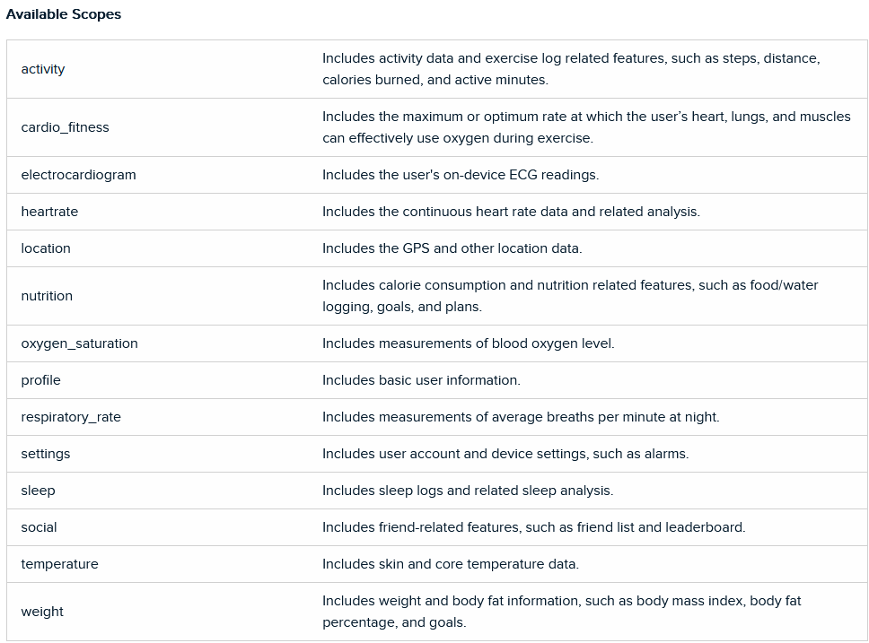

# Tracking the Transition: An Analysis of Fitbit Data Across Borders

For nearly four years, I've relied on my Fitbit to track virtually every aspect of my daily routine, from the number of steps I take to the quality of my sleep. Even when I go for a stroll or hit the gym, I make sure to wear my trusty device, eager to see how my fitness metrics stack up against my previous workouts. It's a thrilling feeling to watch my physique improve over time, and I'm always eager to see how I can further refine my health habits using the rich data that Fitbit provides.  Since moving to Canada last year, my daily routine has undergone a significant transformation (new country, new life?), and I've noticed that this shift has impacted various aspects of my life. Specifically, I've observed that my physical activity level and quality of sleep have been affected, but to what extent remains unclear. Fortunately, I've consistently relied on my Fitbit to track my daily activity and sleep patterns, enabling me to investigate these changes in greater detail. With this project, my main objectives are to:

- Analyze how my level of physical activity and exercise has changed since moving to Canada
- Evaluate how my sleep has been impacted during this time
- Explore the Fitbit data for any interesting insights regarding my overall health and wellness.

### Collecting the Fitbit data

Extracting data from a Fitbit device may seem daunting, but fortunately, Fitbit provides a <a href = "https://dev.fitbit.com/build/reference/web-api/developer-guide/">developer guide</a> to help users establish a connection to their account and access the data they need. This guide is an invaluable resource, containing a comprehensive list of available resources and endpoints, along with details on the syntax required, expected responses, and descriptions of each element returned by every endpoint.  it's essential to read the <a href="https://dev.fitbit.com/build/reference/web-api/developer-guide/best-practices/">Best Practices</a> section of the developer guide. This section provides valuable guidance on how to optimize your application's performance and improve the user experience. It covers crucial topics such as caching, pagination, error handling, and rate limiting, all of which are essential considerations when working with an API.  During my analysis, I needed data from the past year and quickly discovered the <a href="https://dev.fitbit.com/build/reference/web-api/developer-guide/application-design/#Rate-Limits">rate limits</a> that apply to the Fitbit Web API. Although these rate limits presented a minor inconvenience while extracting the information, they were ultimately a necessary measure to ensure the API's stability and reliability. To work around this limitation, I had to think creatively about how to store my data efficiently.

Once you've established a connection you'll gain access to a wealth of data and resources.

### Preserving the data

