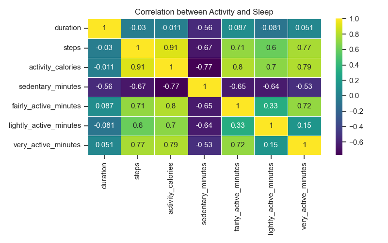

# Tracking the Transition: An Analysis of Fitbit Data Across Borders

<p align="justify">For nearly four years, I've relied on my Fitbit to track virtually every aspect of my daily routine, from the number of steps I take to the quality of my sleep. Even when I go for a stroll or hit the gym, I make sure to wear my trusty device, eager to see how my fitness metrics stack up against my previous workouts. It's a thrilling feeling to watch my physique improve over time, and I'm always eager to see how I can further refine my health habits using the rich data that Fitbit provides.<br><br>Since moving to Canada last year, my daily routine has undergone a significant transformation (new country, new life?), and I've noticed that this shift has impacted various aspects of my life. Specifically, I've observed that my physical activity level and quality of sleep have been affected, but to what extent remains unclear. Fortunately, I've consistently relied on my Fitbit to track my daily activity and sleep patterns, enabling me to investigate these changes in greater detail. With this project, my main objectives are to:</p>

- Analyze how my level of physical activity and exercise has changed since moving to Canada
- Evaluate how my sleep has been impacted during this time
- Explore the Fitbit data for any interesting insights regarding my overall health and wellness.

### Collecting the Fitbit data

<p align="justify">Extracting data from a Fitbit device may seem daunting, but fortunately, Fitbit provides a <a href = "https://dev.fitbit.com/build/reference/web-api/developer-guide/">developer guide</a> to help users establish a connection to their account and access the data they need. This guide is an invaluable resource, containing a comprehensive list of available resources and endpoints, along with details on the syntax required, expected responses, and descriptions of each element returned by every endpoint.<br><br>it's essential to read the <a href="https://dev.fitbit.com/build/reference/web-api/developer-guide/best-practices/">Best Practices</a> section of the developer guide. This section provides guidance on how to optimize your application's performance. It covers crucial topics such as caching, pagination, error handling, and rate limiting, all of which are essential considerations when working with an API.<br><br>During my analysis, I needed data from the past year and quickly discovered the <a href="https://dev.fitbit.com/build/reference/web-api/developer-guide/application-design/#Rate-Limits">rate limits</a> that apply to the Fitbit Web API. Although these rate limits presented a minor inconvenience while extracting the information, they were ultimately a necessary measure to ensure the API's stability and reliability. To work around this limitation, I had to think creatively about how to store my data efficiently.</p>

Once you've established a connection you'll gain access to a wealth of data and resources.
<p align="center">
  
 </p>

### Preserving the data

<p align="justify">Due to the significant amount of data needed and the rate limits imposed by the Fitbit Web API, storing the data in CSV files was not a viable option. Instead, I opted to create a local PostgreSQL database to securely store the data.<br><br>To get started, I downloaded and installed the latest version of <a href="https://www.postgresql.org/download/">PostgreSQL</a> and set up the database. I then created a table for each API endpoint, specifying the necessary columns and data types for each one. By organizing the data in this way, I could easily access and analyze the information using SQL queries. The database backup can be found <a href="https://github.com/LeoPradilla/FitSleep/blob/main/files/fitbit_api_db">here</a>.</p>

### Collecting and processing the data

<p align="justify">The API provides a range of endpoints for retrieving data on activities, sleep, heart rate, steps, and more. These endpoints respond with a JSON object containing the requested data. The exact format and structure of the response will depend on the endpoint and the specified parameters. The JSON response needs to be parsed and processed to extract the data you need.

For example, to request information about sleep, the endpoint <a href="https://dev.fitbit.com/build/reference/web-api/sleep/get-sleep-log-list/">Get Sleep Log List</a> should be use. This endpoint requires the optional parameters "beforeDate" and "afterDate", as well as the mandatory parameters "sort", "limit", and "offset". The response will include information about the duration of the sleep, efficiency, sleep levels, and more, along with metadata such as the date for which the data is being reported.

Once the information has been extracted, I used the Pandas function `json_normalize` to flatten the JSON response into a DataFrame. Then, I performed exploratory data analysis (EDA) as needed, before finally dumping the DataFrame into the database.</p>

The code and the list of the endpoints used can be found in this <a href="https://github.com/LeoPradilla/FitSleep/blob/main/files/fitbit_conn.ipynb">jupyter notebook</a>.

<p align="justify">
Note: 
It's important to acknowledge that the data collected may have some limitations due to sporadic data collection. There were days when I forgot to wear the device, or it failed to record data. While this may introduce some challenges to the analysis process, it also reflects the unpredictable nature of our daily lives. As an analyst, I must work with the data available to me and make the most of my findings, taking into account any limitations of the dataset.</p>


### Data Exploration and Analysis

<p align="justify">While exploring the data, I found some inconsistencies with sleep variables, particularly with the duration variable. To detect outliers, I used visual inspection by creating a histogram and a boxplot to identify points that were far away from the bulk of the data.</p>

<p align="center">
     
</p>

I used `pd.describe()` to get a quick overview of the distribution of `duration`

```python
# check stats
sleep_df['duration'].describe()
```
<p align="center">
  
</p>

<p align="justify">
What is this telling me?

A duration of only 180 minutes, which is equivalent to three hours, is not enough to be considered a complete sleep cycle. Additionally, there may be instances where the Fitbit device fails to capture my sleeping data or where the battery dies while I'm sleeping, resulting in incomplete or inaccurate data. Therefore, removing these outliers will improve the accuracy and reliability of the data, enabling more precise analyses and better insights.

To remove the outliers I used the <a href="https://statisticsbyjim.com/basics/interquartile-range/">interquartile range (IQR)</a> method, which involves calculating the IQR and then defining outliers as values that fall below the first quartile minus 1.5 times the IQR, or above the third quartile plus 1.5 times the IQR."</p>

```python
# Using IQR
q75,q25 = np.percentile(sleep_df['duration'],[75,25])
iqr = q75 - q25
lower_limit = q25 - 1.5*iqr
upper_limit = q75 + 1.5*iqr
```
By using the lower and upper limits, the outliers can be trimmed.

```python
# select the index
drop_index = sleep_df[(sleep_df['duration']<lower_limit)|(sleep_df['duration']>upper_limit)].index

# drop the outliers
sleep_df = sleep_df.drop(drop_index,axis=0)
```
Find the analysis for this project in the <a href="/files/analyzing_data.ipynb">Jupyter Notebook</a>, which includes data sources, processing methods, and analytical techniques.

#### Sleep analysis

<p align="justify">Having a good night's sleep is vital for maintaining overall health and well-being. While sleeping, our body performs essential functions, including repairing tissues, regulating hormones, growing muscles, and enhancing immune system function. Not getting enough sleep or having poor quality sleep can have detrimental effects on our health, such as decreased cognitive function, impaired decision-making, and an increased risk of accidents, illness, and disease.</p>

<p align="justify">In August 2022, I relocated to Canada from Colombia. Consequently, I separated the original sleep data into two groups, one comprising data collected after my move to Canada and the other containing data collected before that and then computed some basic statistics for each group.</p> 

<p align="center">
    
</p>

<p align="justify">I found that in Colombia, my mean duration of sleep is 454 minutes (or approximately 7.5 hours), which is slightly longer than in Canada at 442 minutes (or approximately 7.36 hours), with a difference of approximately 12 minutes. However, the standard deviation of my sleep duration is slightly higher in Canada (60 minutes) than in Colombia (56 minutes), suggesting that there is greater variability in sleep duration since I arrived in Canada.</p>

**Sleep Stages**

<p align="justify">Each sleep stage has its own unique characteristics and functions, and play crucial roles in maintaining overall health and well-being.. Deep sleep, also known as slow-wave sleep, is important for physical restoration, including the repair of tissues and the release of growth hormones. REM sleep, on the other hand, is essential for cognitive function and memory consolidation, and is also associated with emotional regulation and creativity. Finally, light sleep is important for maintaining the sleep-wake cycle and allowing the body to transition between different stages of sleep. </p>

<p align="center">
     
</p>

Comparing my sleep stages between Canada and Colombia:

<p align="center">
     
</p>
<p align="center">
    <em>Sleep Stages by Country</em>
</p>


<p align="justify">Based on my sleep data, I have found that my light sleep accounts for 60.2% of my nightly sleep, while deep sleep accounts for 16.3%, and REM sleep accounts for 11%. These proportions differ slightly from the <a href="https://blog.fitbit.com/sleep-stages-explained/">recommended amounts for adults</a>, which suggest that light sleep should make up 50-60% of the night, deep sleep should make up 10-25%, and REM sleep should make up 20-25%. This information suggest that my sleep stages were not significantly affected by the move to Canada. However, it does suggest that I should focus on increasing the duration of my deep sleep. night.</p>

Finally, it's important to assess whether there is any correlation between the duration of my sleep and the other variables.

<p align="center">
     
</p>
<p align="center">
    <em>Correlation between variables</em>
</p>

<p align="justify">Based on the data, it appears that a longer duration of sleep could lead to more REM and light sleep. Interestingly, the day of the week does not seem to significantly affect the duration of sleep. Additionally, the data indicates that a longer sleep duration may not necessarily result in better sleep quality.

Surprisingly, the data suggests that my transition from Colombia to Canada had little to no impact on the duration and quality of my sleep. However, it is possible that this transition has affected my lifestyle, particularly my activity levels. Let's explore my activity data.
</p>


#### Activity analysis

<p align="justify">According to <a href="https://www.who.int/news-room/fact-sheets/detail/physical-activity">World Health Organization (WHO)</a>, it is recommended that adults engage in at least 150-300 minutes of moderate-intensity aerobic physical activity, or 75-150 minutes of vigorous-intensity aerobic physical activity, or a combination of both types of activity every week. It's also suggested that muscle-strengthening activities that work all major muscle groups be performed at moderate or greater intensity on 2 or more days per week. By following these recommendations, individuals can improve their overall health and well-being.

To stay active during the week, I've been running on a treadmill or outdoors (when possible) and working out at the gym. Based on the graph below, I discovered that during my time in Colombia, I was averaging two strength exercises per week and running for 163 minutes per week, which is just within the lower recommended threshold. Unfortunately, since moving to Canada, my activity levels have worsened. I'm now working out at the gym an average of 1.5 times per week and running for only 142 minutes per week.</p>

<p align="center">
     
</p>
<p align="center">
    <em>Strenght and Cardio activity</em>
</p>

<p align="justify">I'm shocked to learn that my current level of physical activity is falling below the recommended guidelines set by the World Health Organization (WHO). Despite considering myself a very active person, my average activity falls slightly below the recommended levels. While I can attribute this to factors like the Canadian winter and a busy schedule with work and studies, the reality is that I need to increase both the frequency and duration of my exercise routine.</p>

<p align="center">
     
</p>
<p align="center">
    <em>Calories by activity</em>
</p>

<p align="justify">Upon closer examination of each activity, it is evident that I have been engaging in considerably less exercise since coming to Canada. In total, I burned a cumulative 61.768 calories in Colombia, compared to only 47.742 in Canada, representing a 22% decrease in calories burned.</p>

#### Does Exercise Impact Sleep Quality?

Finally, let's examine whether the amount of exercise has any relationship to the amount and quality of my sleep.

<p align="center">
     
</p>
<p align="center">
    <em>Activity vs Sleep</em>
</p>

<p align="justify">According to the <a href="https://www.sleepfoundation.org/physical-activity/exercise-and-sleep">Sleep Foundation</a>, exercising improves sleep for many people by enhancing sleep quality and reducing the time it takes to fall asleep. However, based on my data, it appears that I am not one of those individuals. While I could not find a strong correlation between active levels of activity and sleep duration, I did observe a negative impact on the time I spend sleeping when I am sedentary.</p>


